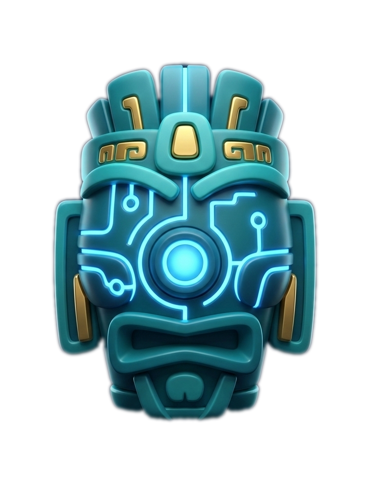
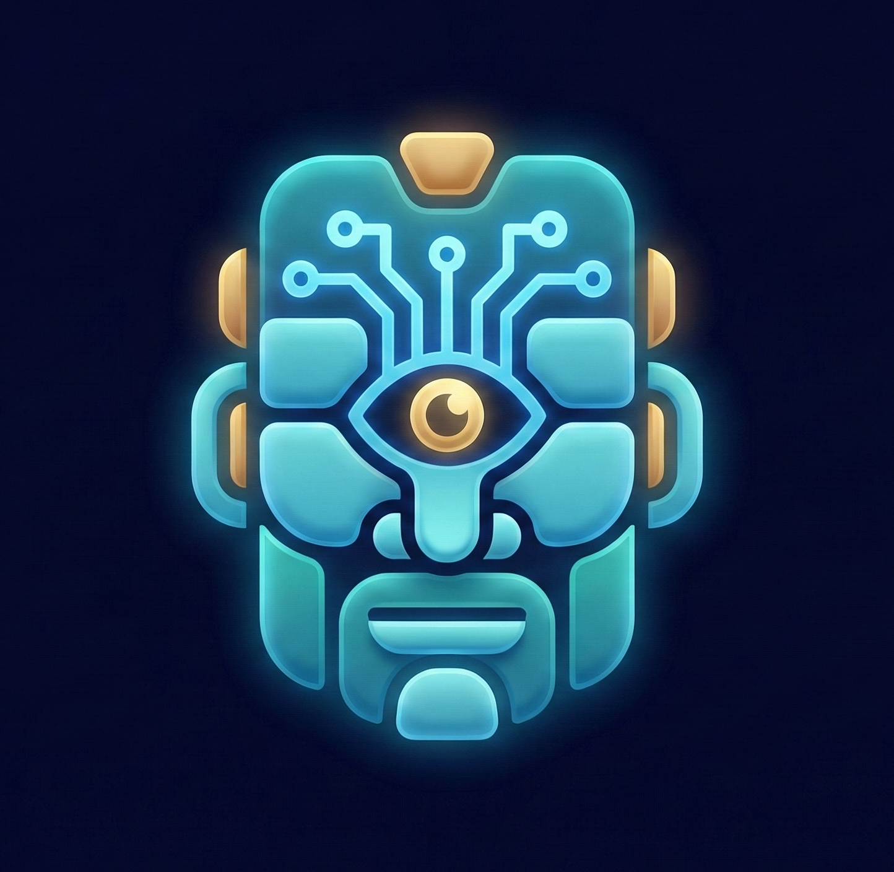
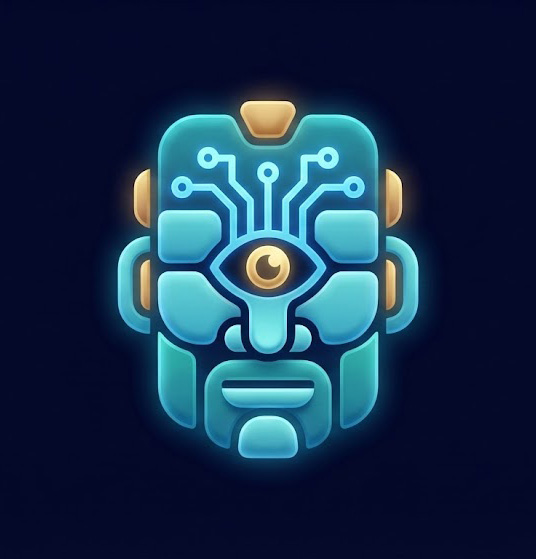
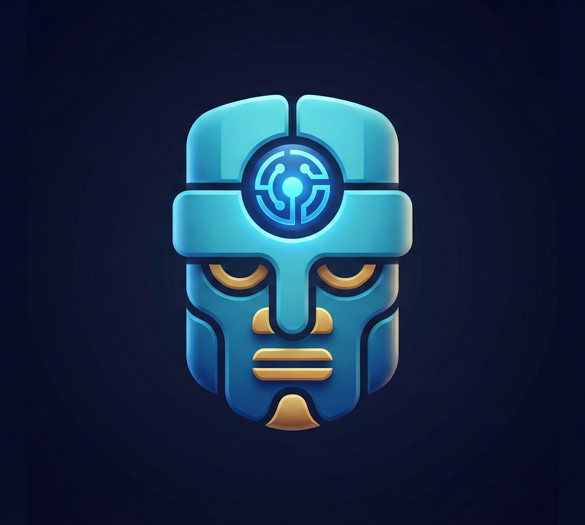

<div align="center">

  # ✨ VS_oxotn1k25
  ### 💻 Developer • 🎨 3D Artist • 🖌️ Designer
  
  <i>Blending code and creativity. Exploring AI, generative art, and building things that look as good as they work.</i>

  ---

  

  ### 🎨 Gallery
  <a href="images/ico_ai.png">
    
  </a>
  <a href="images/ico_ai2.jpg">
    
  </a>
  <a href="images/ico_ai3.png">
    
  </a>

</div>

---

## 🛠️ Tech Stack & Tools

<details open>
<summary><b>💾 Design & Creative Tools</b></summary>

| Tool | Purpose |
|------|---------|
| 🎨 Adobe Photoshop | Digital Art & Photo Editing |
| 🖌️ Adobe Illustrator | Vector Design & Graphics |
| 🎬 After Effects | Motion Graphics & Animation |
| 🧊 Blender | 3D Modeling & Rendering |
| 🗿 ZBrush | Digital Sculpting |

</details>

<details open>
<summary><b>💻 Development & Tech</b></summary>

| Tool | Purpose |
|------|---------|
| 🐍 Python | Scripting & Automation |
| 🤖 ComfyUI | AI Image Generation Pipelines |
| 🐳 Docker | Containerization |
| 🔗 Git | Version Control |
| 🗄️ PostgreSQL | Database Management |
| 📦 SQLite | Lightweight Database |
| 🐧 Linux | Development Environment |

</details>

---

## 🚀 What I'm Working On

<details>
<summary><b>🤖 Telegram Bots & Automation</b></summary>

- Workflow optimization and bot architecture
- Intelligent automation solutions
- Scalable deployment strategies
- Custom integrations and APIs

</details>

<details>
<summary><b>🎭 Generative Art & AI</b></summary>

- ComfyUI workflows and node systems
- Flux model implementations
- Advanced AI image pipelines
- Neural art generation experiments

</details>

<details>
<summary><b>🎨 UI/UX Design</b></summary>

- Digital paintings and illustrations
- Interface design & prototyping
- Comprehensive branding systems
- User experience optimization

</details>

<details>
<summary><b>💡 Web Development</b></summary>

- Clean, functional web applications
- Beautiful UI implementations
- Modern web technologies
- Full-stack development

</details>

---

## 💡 Interests & Passion

```
🧠 Neural Networks        🎮 Game Development      ✨ Creative Tools
🌐 Web Tech              📊 Data Visualization     🎬 Motion Graphics
🔮 Procedural Generation  🎯 Optimization         🌌 Sci-Fi & Futurism
```

> Passionate about the intersection of **art and technology**, always exploring new ways to merge design principles with code.

---

## 📫 Let's Connect

<div align="center">

[](mailto:lstunn25ai@gmail.com)
[](https://github.com/VS_oxotn1k25)

<br/>

### 📊 GitHub Stats


---

<sub>Last updated: January 2026 | Creative Developer & Digital Artist</sub>

</div>